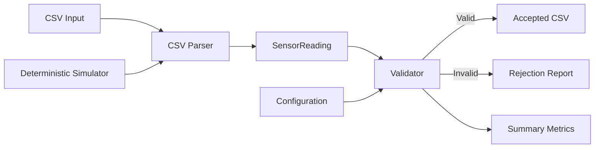
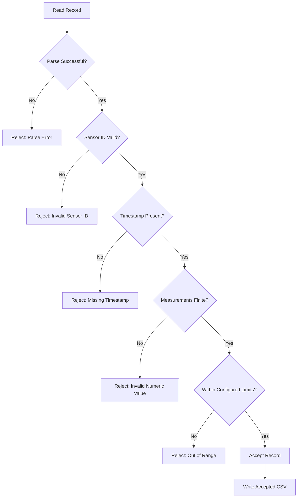
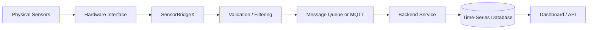

# SensorBridgeX
## Software-Only Embedded Linux Sensor Gateway

   

SensorBridgeX is a C++17 user-space sensor-data gateway prototype designed for Linux/Ubuntu/WSL. It ingests sensor-like readings from CSV files or a deterministic built-in simulator, converts them into structured records, validates the records against configurable rules, rejects invalid data with reasons, and exports accepted readings.

The current implementation is intentionally **software-only**. It does not require physical sensors, GPIO, I²C, SPI, UART, a kernel module, or root access.

## Project Summary

SensorBridgeX demonstrates the core software responsibilities that commonly exist between a sensor-data source and downstream processing:

- Input acquisition from CSV files or a deterministic simulator
- Parsing raw records into typed C++ data structures
- Validation of sensor identifiers and measurement values
- Configurable temperature and humidity limits
- Explicit accepted/rejected processing
- Rejection reasons for invalid records
- Summary counters for processed, accepted, and rejected records
- CSV output for downstream use
- Automated tests with CTest
- Reproducible Linux builds with CMake
- Optional containerized execution with Docker

## Problem

Sensor data cannot always be trusted simply because it was received. A gateway layer should detect malformed or out-of-range values before they are passed to later processing stages.

For example, a temperature value such as `155.0` may be syntactically valid as a number but invalid for the configured operating range. SensorBridgeX separates these concerns by first parsing the record and then applying domain validation rules.

## Solution

SensorBridgeX provides a small, deterministic processing pipeline:

```text
Input
  |
  v
Parse
  |
  v
Structured SensorReading
  |
  v
Validate
  |
  +------ Valid ------> Accepted Output
  |
  +------ Invalid ----> Rejection Reason
  |
  v
Summary Metrics
```

The configuration file controls validation limits and processing paths without requiring source-code changes.

## Main Objective

The main objective is to demonstrate a reliable and testable Linux-based software gateway that can:

1. Receive sensor-like records.
2. Parse them into a well-defined structure.
3. Validate each record against configurable rules.
4. Accept valid records.
5. Reject invalid records with an understandable reason.
6. Export accepted data in a reusable format.
7. Provide deterministic output that can be tested and reproduced.

## High-Level Architecture



### Component Responsibilities

| Component | Responsibility |
|---|---|
| Input layer | Reads CSV records or generates deterministic simulated readings |
| Parser | Converts textual CSV fields into typed values |
| SensorReading | Represents one structured sensor record |
| Validator | Applies configured data-quality rules |
| Configuration | Provides limits and file paths without recompilation |
| Output layer | Writes accepted readings to CSV |
| Reporting | Tracks processed, accepted, rejected records and reasons |
| Tests | Verifies parser, validation, and processing behavior |
| CMake | Configures and builds the project |
| Docker | Provides a reproducible container execution environment |

## Data Processing Flow



## Validation Rules

The current implementation validates the following:

### Sensor ID

The sensor identifier must be valid and positive.

```text
sensor_id = 7      -> valid
sensor_id = -1     -> rejected
```

### Timestamp

The timestamp field must not be empty.

The current implementation checks presence rather than performing full ISO-8601 parsing, timezone validation, or clock synchronization.

### Numeric Measurements

Temperature and humidity values must be finite numeric values.

Invalid examples include values that cannot be parsed as numbers or non-finite floating-point values.

### Temperature Range

Temperature is checked against the configured minimum and maximum values. For example, a temperature of `155.0` is rejected when it exceeds the configured maximum.

### Humidity Range

Humidity is checked against the configured limits. A value outside the configured range is rejected rather than being written to the accepted output.

## Configuration

The configuration file allows processing rules and paths to be changed without recompiling the application.

Typical configuration responsibilities include:

- Input file path
- Output file path
- Minimum temperature
- Maximum temperature
- Minimum humidity
- Maximum humidity

This keeps application logic separate from deployment-specific settings.

## Input and Output

### Example Input

```csv
sensor_id,timestamp,temperature,humidity
1,2026-10-01T10:00:00,25.4,51.2
2,2026-10-01T10:01:00,28.1,47.8
3,2026-10-01T10:02:00,155.0,45.0
```

The third record can be rejected when `155.0` exceeds the configured temperature limit.

### Processing Result

The application reports processing statistics such as:

```text
Received: 3
Accepted: 2
Rejected: 1
Output: build/accepted_readings.csv
```

Rejected records are accompanied by a reason so that invalid input can be diagnosed instead of silently discarded.

## Deterministic Simulator

The built-in simulator provides repeatable sensor-like data without requiring physical hardware.

Run:

```bash
./build/sensorbridgex --config config/sensorbridgex.conf --simulate --output build/simulated.csv
```

The simulator is useful for development, automated testing, demonstrations, reproducing the same processing scenario, and running the project in Ubuntu/WSL without external devices.

## Invalid Data Demonstration

The repository includes intentionally invalid records to demonstrate the validation path.

Run:

```bash
./build/sensorbridgex --config config/sensorbridgex.conf --input data/invalid_sensor_readings.csv --output build/invalid.csv
```

The invalid-data test file is intended to exercise the rejection path. The application reports the rejected records and their reasons.

## Repository Structure

```text
SensorBridgeX/
├── README.md
├── CMakeLists.txt
├── Dockerfile
├── docker-compose.yml
├── LICENSE
├── .gitignore
├── .dockerignore
│
├── config/
│   └── sensorbridgex.conf
│
├── data/
│   ├── sensor_readings.csv
│   └── invalid_sensor_readings.csv
│
├── include/
│   └── sensorbridgex/
│       ├── config.hpp
│       ├── csv.hpp
│       ├── reading.hpp
│       └── validator.hpp
│
├── src/
│   ├── config.cpp
│   ├── csv.cpp
│   ├── main.cpp
│   ├── simulator.cpp
│   └── validator.cpp
│
├── scripts/
├── tests/
├── docs/
└── systemd/
```

## Build and Run on Ubuntu / WSL

### 1. Install dependencies

```bash
sudo apt update
sudo apt install -y build-essential cmake
```

### 2. Configure the project

```bash
cmake -S . -B build -DCMAKE_BUILD_TYPE=Release
```

### 3. Build

```bash
cmake --build build -j
```

### 4. Run tests

```bash
ctest --test-dir build --output-on-failure
```

### 5. Run the application

```bash
./build/sensorbridgex --config config/sensorbridgex.conf
```

## One-Line Build and Test

For a clean build and test cycle:

```bash
cmake -S . -B build -DCMAKE_BUILD_TYPE=Release && cmake --build build -j && ctest --test-dir build --output-on-failure
```

## Command-Line Interface

The application supports:

| Option | Purpose |
|---|---|
| `--config PATH` | Load configuration from a file |
| `--input PATH` | Process a CSV input file |
| `--output PATH` | Select the output CSV path |
| `--simulate` | Generate deterministic simulated readings |
| `--help` | Display command-line usage |

## Testing

SensorBridgeX uses CMake and CTest for automated verification.

The test suite covers important behaviors such as:

- Valid sensor records
- Invalid sensor identifiers
- Invalid numeric values
- Temperature range violations
- Humidity range violations
- CLI smoke behavior
- Processing and output behavior

Run:

```bash
ctest --test-dir build --output-on-failure
```

## Docker

SensorBridgeX can also be built and executed using Docker.

```bash
docker compose build
mkdir -p output
docker compose run --rm sensorbridgex
```

Containerization provides a consistent execution environment and keeps the host environment independent from the application's runtime packaging.

## systemd Example

The repository includes a systemd service example for Linux deployments. The service configuration is provided as a deployment example; the application can also be executed directly from the command line.

## Design Decisions

### Software-only input

CSV and deterministic simulation were selected so the complete data-processing pipeline can be developed and tested without requiring physical sensors.

### Configuration-driven validation

Validation limits are kept outside the application source code so they can be changed for different environments without recompiling.

### Explicit rejection reasons

Invalid records are not silently dropped. A rejection reason makes data-quality problems easier to understand and debug.

### C++17

C++17 provides strong typing, standard-library facilities, RAII, and modern language features while remaining suitable for Linux systems programming.

### CMake

CMake provides a reproducible build configuration and integrates naturally with CTest.

## Software-Only Scope

The current implementation deliberately does **not** include:

- Physical temperature/humidity sensors
- GPIO access
- I²C communication
- SPI communication
- UART communication
- Modbus communication
- Linux kernel character-device driver
- MQTT broker integration
- HTTP/REST networking
- Database storage
- Web dashboard
- Machine-learning inference
- Hardware-specific firmware

These are possible future extensions rather than current implemented features.

## Future Production Architecture

A larger deployment could extend the current software gateway as follows:



Potential future interfaces include I²C, SPI, UART, or Modbus on an appropriate embedded Linux device. These interfaces are not part of the current implementation.

## Possible Extensions

Future development could add:

- Sensor calibration
- Moving-average or other signal filtering
- Persistent buffering and store-and-forward
- MQTT or HTTP transport
- Time-series database storage
- Monitoring and alerting
- Device authentication
- TLS-secured communication
- Secure device identity
- Signed updates
- Resource and performance monitoring
- Edge anomaly detection

## Reliability Considerations

For a production gateway, additional reliability mechanisms would be required, including:

- Bounded queues
- Backpressure handling
- Persistent buffering
- Retry policies
- Graceful shutdown
- Recovery after process restart
- Input and output integrity checks
- Operational logging
- Health monitoring

These mechanisms are architectural extensions and are not claimed as fully implemented in the current prototype.

## Security Considerations

The current application is a local software prototype. A production deployment should additionally consider:

- Least-privilege execution
- Input sanitization
- Secure configuration handling
- TLS for network communication
- Device identity and authentication
- Authorization
- Secret and certificate management
- Container hardening
- Signed software updates
- Secure boot where supported

No physical-device security or network security should be inferred from the current CSV-based implementation.

## Performance and Scalability

The current implementation is designed for correctness, deterministic behavior, and easy testing rather than benchmarked production throughput.

For a production system, useful measurements would include:

- Records processed per second
- Processing latency
- Acceptance/rejection rate
- CPU utilization
- Memory consumption
- Queue depth
- Output/write latency
- Recovery time after failures

Scaling decisions should be based on measured workload characteristics. Concurrency, batching, queues, and distributed message brokers can be introduced when the workload requires them.

## Error Handling Philosophy

SensorBridgeX follows an explicit processing model:

```text
Receive -> Parse -> Validate -> Accept/Reject -> Report
```

The goal is to make failures visible and actionable instead of silently producing potentially unsafe or misleading output.

## Development Environment

Recommended environment:

- Ubuntu Linux or Ubuntu on WSL
- C++17 compiler
- CMake
- CTest
- Git
- Optional Docker

The project is designed to run without special hardware and without root privileges for normal application execution.

## Quick Start

After cloning the repository:

```bash
cd SensorBridgeX
cmake -S . -B build -DCMAKE_BUILD_TYPE=Release
cmake --build build -j
ctest --test-dir build --output-on-failure
./build/sensorbridgex --config config/sensorbridgex.conf
```

## Project Status

**Status: Functional software-only prototype**

The current project provides a local data-ingestion, parsing, validation, rejection, reporting, output, and testing workflow.

It is suitable as a Linux/C++ software architecture demonstration and as a foundation for future embedded-device integration.

## License

See `LICENSE` for the repository license.

## Important Scope Note

SensorBridgeX should be evaluated based on the functionality implemented in this repository. Hardware integration, kernel drivers, network protocols, databases, dashboards, production certification, and performance guarantees are not part of the current implementation unless separately added and tested.
